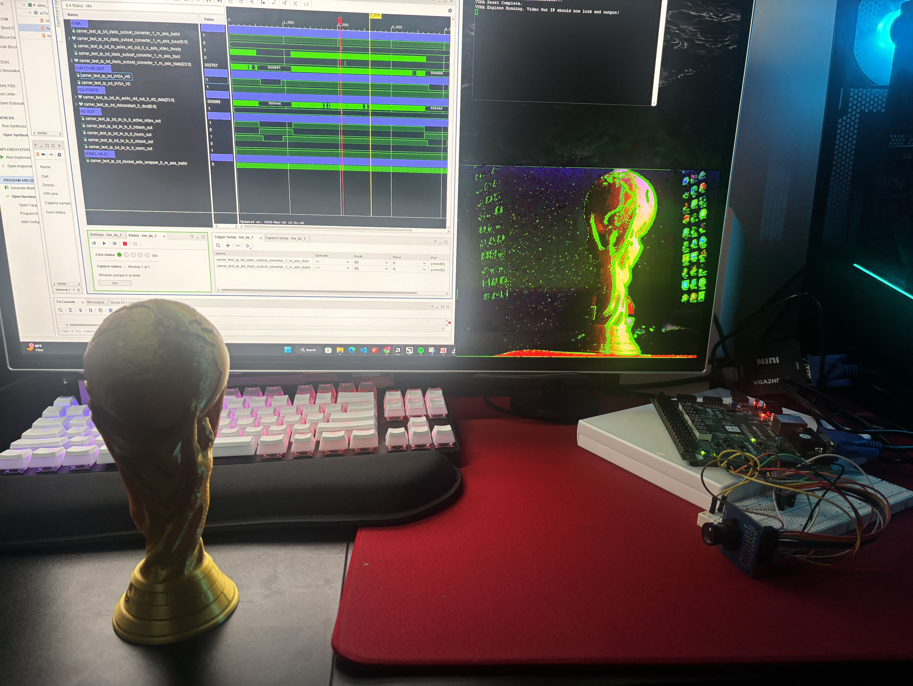
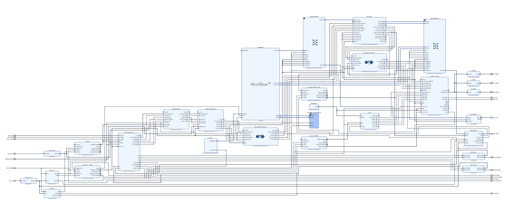

# Real-Time Edge Detection System: Nexys A7 FPGA

## Project Overview

This project implements a high-performance, real-time computer vision pipeline on a Xilinx Artix-7 FPGA. The system captures live video from an OV7670 camera, performs spatial gradient calculations using a custom Sobel filter, and outputs the result via VGA at 640x480 resolution.

The design is entirely hardware-accelerated, utilizing the AXI4-Stream protocol to move data between custom RTL kernels and high-speed DDR2 memory with zero CPU intervention in the data path.

## System Architecture

The architecture is centered around a "greedy" downstream pipeline that prioritizes display stability.

  * **Custom RTL Capture:** An OV7670 controller captures 16-bit RGB565 data and encapsulates it into AXI4-Stream packets using `TUSER` for Start-of-Frame (SOF) and `TLAST` for End-of-Line (EOL) signaling.
  * **Sobel DSP Core:** A custom-written 3x3 convolution engine calculates image magnitude. I implemented line buffers to stack incoming pixels, allowing the gradients to be calculated in a single clock cycle.
  * **Memory Interconnect:** A Xilinx VDMA (Video DMA) engine manages a triple-frame buffer in the onboard DDR2 memory. This ensures the display remains tear-free by decoupling the camera's capture rate from the monitor's refresh rate.
  * **Video Output Bridge:** The `v_axi4s_vid_out` IP bridges the AXI domain to the physical VGA pins, using an internal asynchronous FIFO to handle the clock domain crossing from the 100 MHz AXI clock to the 25.2 MHz VGA pixel clock.

## Key Engineering Challenges Conquered

### 1\. The AXI-Stream Width Mismatch

During hardware bring-up, I discovered a "shifting pixel" artifact. The VDMA was reading 32-bit chunks, but the Video Out IP expected 24-bit pixels. Vivado's default width converter was incorrectly packing bytes across pixel boundaries. I resolved this by designing a custom **AXI4-Stream Subset Converter** remap string that explicitly truncates the padding bits without altering the pixel timing.

### 2\. VDMA "GenLock" Deadlocks

The Sobel filter’s internal pipeline latency caused the `TUSER` (SOF) signal to arrive slightly out of phase, causing the VDMA to crash with framing errors. I implemented a "Flush on Fsync" software override in the MicroBlaze C-driver, allowing the VDMA to gracefully re-sync to the camera's frame rate without halting the system.

### 3\. VTC Polarity & Monitor Sync

Modern displays often require active-low sync pulses for VESA standard compliance. [cite_start]I configured the **Video Timing Controller (VTC)** to generate these polarities while operating in "Slave Mode," allowing the Video Out IP to control the VTC's phase via a lagging mechanism to ensure perfect frame alignment.

## Repository Structure
  * **`/rtl`**: Custom SystemVerilog IP cores (OV7670 Interface, Sobel Filter, AXI Wrappers).
  * **`/software`**: Bare-metal C drivers for VDMA and Interrupt Management.
  * **`/docs`**: Full system block diagrams (PDF) and timing specifications.
  * **`/constraints`**: XDC file for Nexys A7 pin-mapping.
